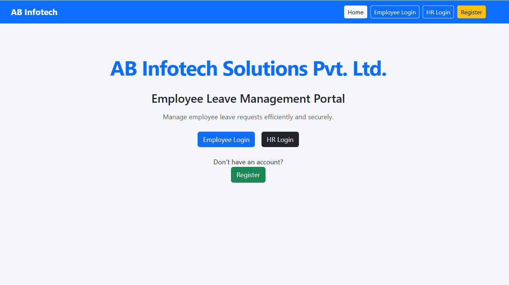
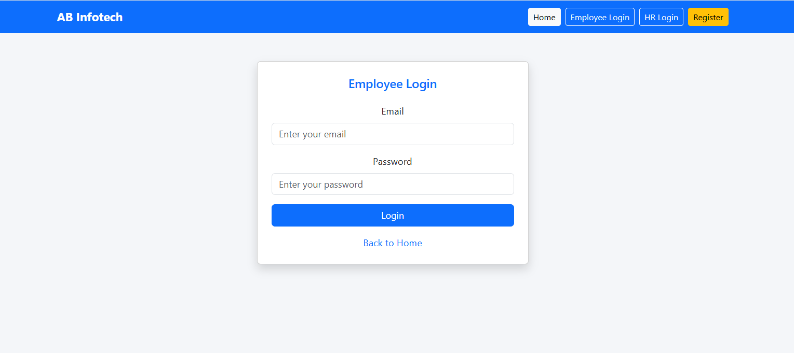
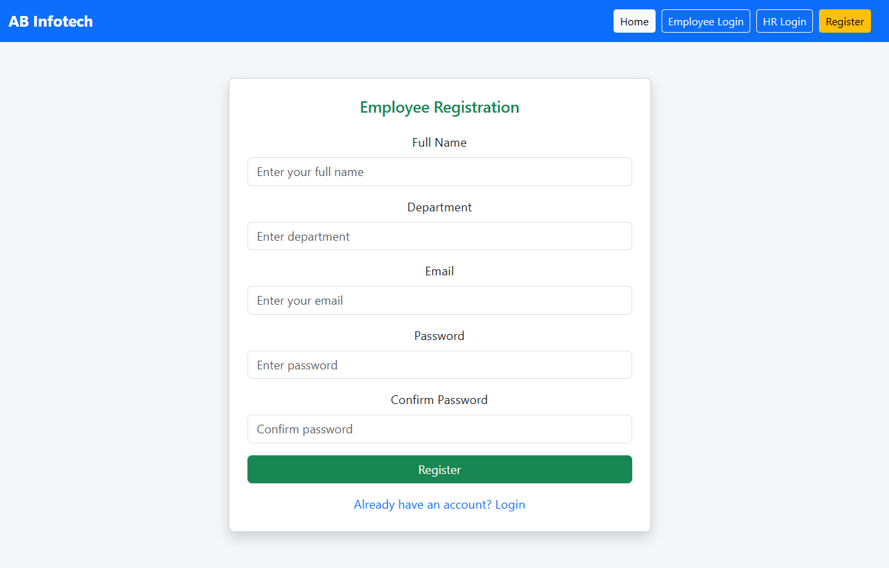
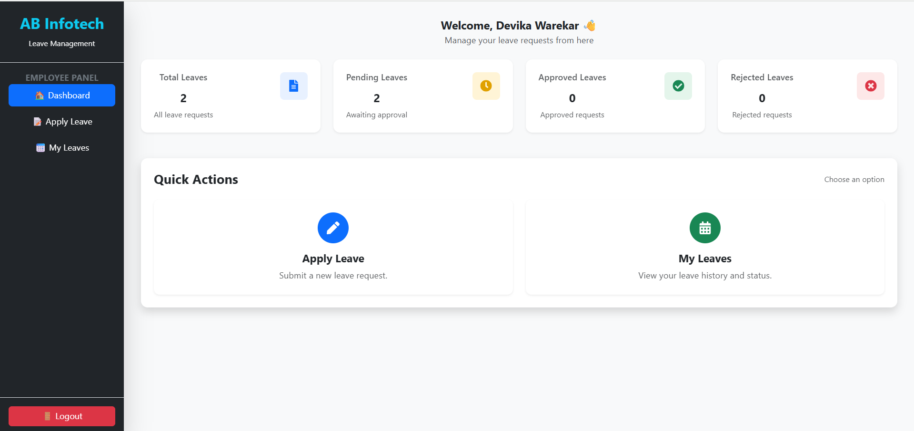
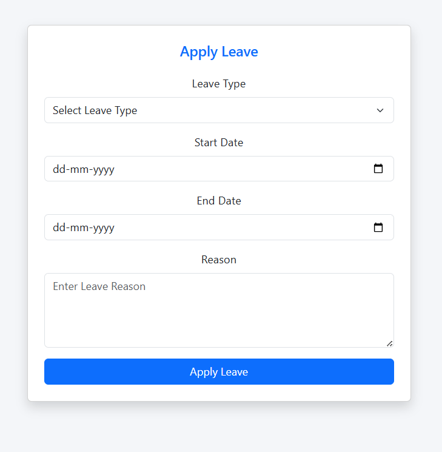
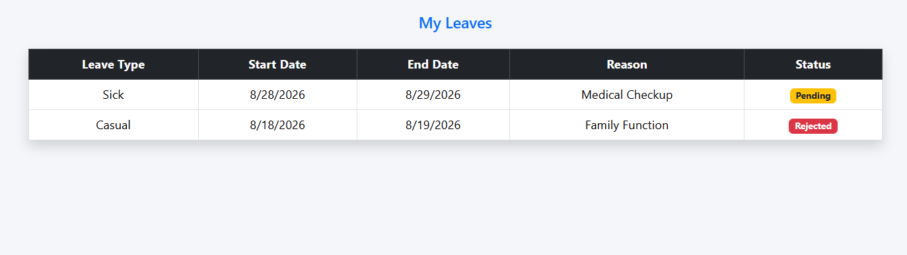
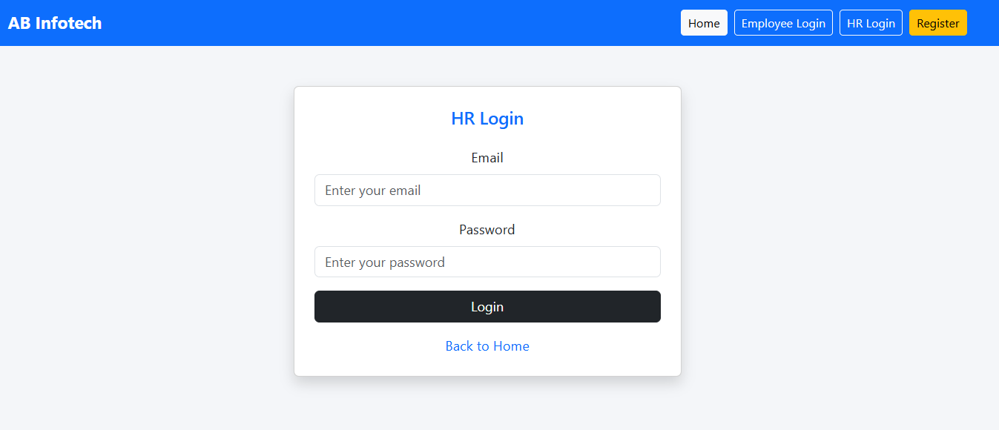
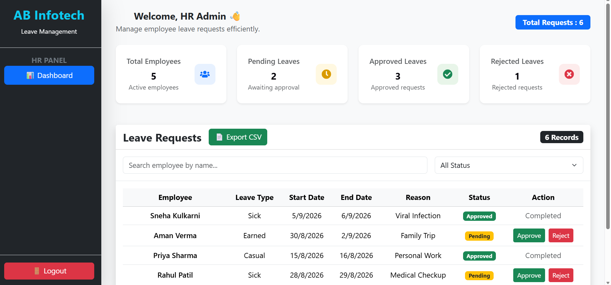

# Employee Leave Management Portal

A Full Stack MERN application developed as a Week-1 Internship Project to digitize the employee leave management process.

---

## 📌 Project Overview

The Employee Leave Management Portal enables employees to submit leave requests online while allowing the HR department to review, approve, or reject them efficiently.

This project is built using the MERN Stack and follows a corporate-style folder structure and authentication system.

---

## 🚀 Features

### Employee

- Employee Registration
- Secure Login (JWT Authentication)
- Apply Leave
- View My Leaves
- Dashboard with Leave Statistics
- Responsive UI

### HR

- Secure HR Login
- Dashboard with Statistics
- View All Leave Requests
- Search Employee
- Filter by Leave Status
- Approve / Reject Leave Requests
- Export Leave Report (CSV)

---

## 🛠️ Tech Stack

### Frontend

- React.js
- React Router DOM
- Axios
- Bootstrap
- React Toastify
- Papa Parse (CSV Export)

### Backend

- Node.js
- Express.js

### Database

- MongoDB Atlas
- Mongoose

### Authentication

- JWT (JSON Web Token)
- bcrypt.js

### Tools

- VS Code
- Git
- GitHub
- Postman

---

## 📂 Project Structure

```
Employee-Leave-Management-Portal/

client/
│
├── src/
│   ├── components/
│   ├── pages/
│   ├── App.jsx
│   ├── main.jsx
│   └── index.css

server/
│
├── controllers/
├── middleware/
├── models/
├── routes/
├── config/
├── server.js

README.md
```

---

## 🔐 Authentication

- Password Hashing using bcrypt
- JWT Authentication
- Protected Routes
- Role-Based Authorization
- Employee and HR Login Separation

---

## 📊 Dashboard Features

### Employee Dashboard

- Total Leaves
- Pending Leaves
- Approved Leaves
- Rejected Leaves

### HR Dashboard

- Total Employees
- Total Requests
- Pending Requests
- Approved Requests
- Rejected Requests

---

## 🔗 REST APIs

### Authentication

| Method | Endpoint |
|---------|----------|
| POST | /api/auth/register |
| POST | /api/auth/login |

### Leave APIs

| Method | Endpoint |
|---------|----------|
| POST | /api/leaves/apply |
| GET | /api/leaves/my |
| GET | /api/leaves |
| PUT | /api/leaves/:id |

---

## 📸 Screenshots

### Home Page


### Employee Login


### Register


### Employee Dashboard


### Apply Leave


### My Leaves


### HR Login


### HR Dashboard


---

## ▶️ Installation

### Clone Repository

```bash
git clone https://github.com/Devika-2004/Employee-Leave-Management-Portal.git
```

### Client

```bash
cd client
npm install
npm run dev
```

### Server

```bash
cd server
npm install
npm run dev
```

---

## 🌐 Environment Variables

Create a `.env` file inside the **server** folder.

```
PORT=5000
MONGO_URI=Your MongoDB Connection String
JWT_SECRET=Your Secret Key
```

---

## 👨‍💼 Demo Login Credentials

### HR Login

Email : hr@gmail.com  
Password : hr@12345

### Employee Login

Email : devika@gmail.com  
Password : Devika@123

> **Note:** Employee registration is available through the Register page. By default, every newly registered user is assigned the **Employee** role. 

To provide HR access, the user's role must be changed from **Employee** to **HR** in the MongoDB database by an administrator. Only users with the **HR** role can access the HR Dashboard and HR-specific features.

---

## 📚 Learning Outcomes

- MERN Stack Development
- REST API Development
- MongoDB Integration
- JWT Authentication
- Role-Based Authorization
- React Routing
- CRUD Operations
- Responsive UI Design

---

## 👩‍💻 Developer

**Devika Warekar**

GitHub:
https://github.com/Devika-2004

LinkedIn:
https://www.linkedin.com/in/devikawarekar

---

## 📄 License

This project is developed for educational and internship purposes.